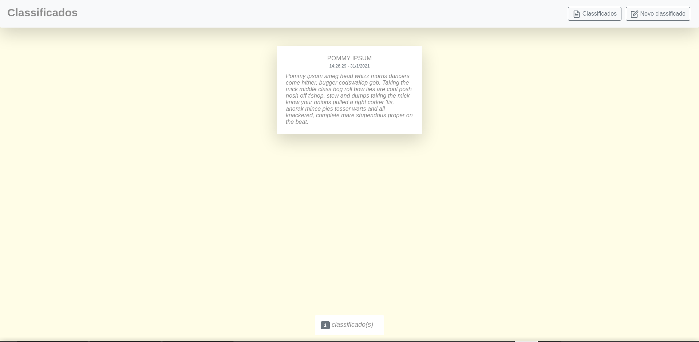
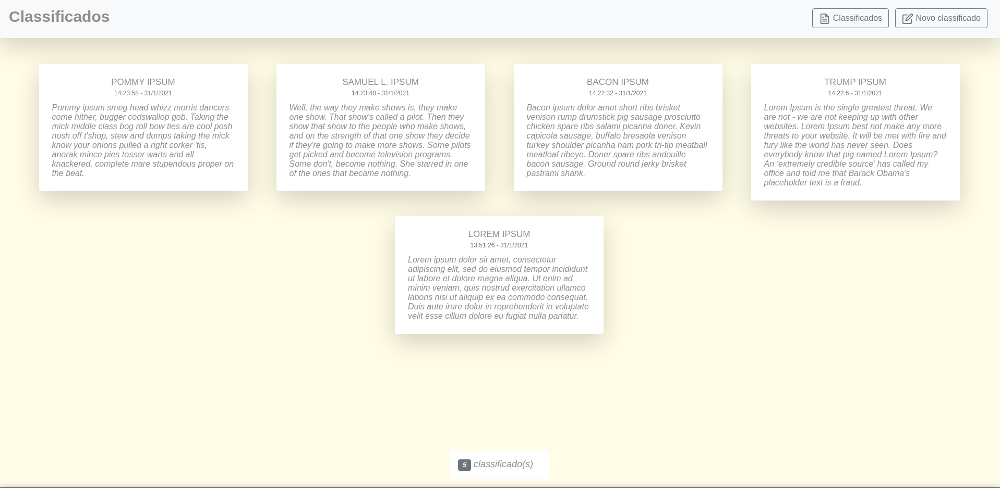

<h1 align="center">
 
  
 
 
  Classifieds Front-end
</h1>

A knowledge test. A current solution for classifieds.

  

  
   
  

## Features
This app features all the latest tools and practices in mobile development!

 React is a JavaScript library for building user interfaces

 Redux is an open source JavaScript library for managing the state of the application.

 TypeScript is an open-source language which builds on JavaScript, one of the world’s most used tools, by adding static type definitions.

 Redux saga is a library that aims to make application side effects (i.e. asynchronous things like data fetching and impure things like accessing the browser cache) easier to manage, more efficient to execute, easy to test, and better at handling failures.

 React loader spinner provides simple React SVG spinner component which can be implemented for async await operation before data loads to the view.

 React icons Include popular icons in your React projects easily with react-icons, which utilizes ES6 imports that allows you to include only the icons that your project is using.

 Components are the heart of React's powerful, declarative programming model. React Router is a collection of navigational components that compose declaratively with your application.

## Getting started

1. clone this repo using `git clone https://github.com/s1lasjee/classifieds.git`
2. Move yourself to the front-end folder: `cd frontend`
3. Run `yarn` to install dependencies
4. Run `yarn start`

## License

This project is licensed under the MIT License - see the [LICENSE](https://opensource.org/licenses/MIT) page for details.
